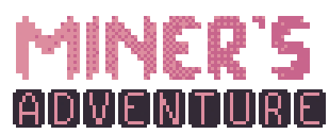

# Miner's Adventure: a 2D platformer by Gustavo S. F.


## Description

This game was made for the Algorithms and Programming class at Universidade Federal do Rio Grande do Sul (*UFRGS*).  
It's a simple, Donkey Kong inspired game about a cave explorer going on a dangerous adventure through some ancient mines!

## Executing the program

* On macOS, just run the command `make run` on the terminal. The game will automatically play from there.

* On Linux, run the command `make run_linux`.  
*Note: Previously, an error could occur when opening the game on Linux machines. This might be due to an internal glitch with Raylib opening the .mp3 music files for streaming (which are located in the assets/musics folder).
See [this post](https://www.reddit.com/r/raylib/comments/1btp10i/raylibs_problem_opening_music_file/).
I have changed them to .wav, but if the error still occurs, just delete them.*

### Controls:

* WASD or arrow keys: Moves player
* Left or right mouse click: Shoots grappling hook
* W, up key or space: Jumps or enters exit door
* Shift: Dash towards the direction being pressed
* TAB: Pauses and unpauses

### Customizability and testing

In [global.h](MinerAdventure/include/global.h), a number of `define`s can be used to change some features in the game. `USE_GLOBAL_CAMERA` sets all of the local positions of the objects to be their global position (to be explained shortly). `DRAW_HITBOXES` draws the outline of the rectangles that define every entity hitbox. `DEBUG_ACTIVE` removes the music, skips transitions, allows flying mode (when pressing 'H' key) and allows the map editor! Pressing a key on the keyboard and using the left mouse button will change the map's blocks to that key! Right mouse button will erase blocks.

## How was the game made?

### Resources info

The game runs on the C programming language with [Raylib](https://www.raylib.com/), a library made for graphical applications. 
Advice from [ChatGPT](https://chatgpt.com) was used, but none of the code (aside from the [makefile](MinerAdventure/makefile)) was written by it.  
For the sprites, I used the online pixel art editor [PixilArt](https://www.pixilart.com/).  
The music was made using Ultrabox. You can find the links (and edit them yourself!) at [beepbox_links.txt](MinerAdventure/readme_assets/beepbox_links.txt).  
Some sounds effects were made by me, but most of them are from [Pixabay](https://pixabay.com/)

### An overview of the programming logic

All alive entities (and projectiles :p) are defined as structs with many different elements, the most important of them being the `PhysicsBody body`. The `PhysicsBody`, defined in [gameObjects.h](include/gameObjects.h)
```
typedef struct {
	Vector2 position;
	Rectangle hitbox;            	// Hitbox do objeto
	Vector2 velocity_vector;     	// Velocidade do objeto
} PhysicsBody;
```
allows for easy move updating and collision checking for all entities using just two functions:
```
void update_body_position(Vector2 new_position, PhysicsBody *b);
float collision_detect_blocks(float *new_velocity, Axis ax, PhysicsBody *b, bool *hit_ground, bool *took_damage, bool body_is_player);
```

The camera being zoomed in are partially done with the following functions, defined in [src/gameObjects.c](MinerAdventure/src/gameObjects.c). `position_rel_to_camera` considers the camera_position (a global variable) to linearly transform the global position of the object (which is the one used for internal calculations) to the local position (the one used to actually show the object on camera). `camera_to_global` does the inverse, and is used for the setting of the hook direction when the cursor is pressed, among other things.
```
Rectangle position_rel_to_camera(Rectangle global_pos_rec);
Rectangle camera_to_global(Rectangle relative_pos_rec);
```


The lights and shadows are done using the render texture `shadows` (defined in [mapa.c](MinerAdventure/src/mapa.c)) with the BlendMode MULTIPLIED, so dark pixels in `shadows` are set to zero and white pixels are set to whatever color is behind it. The shadows of blocks are calculated using the line equation between the middle of the player and the four edges of each block on-screen.

### File documentation
What each src file does:
* `enemy.c` implements enemy AND projectile behaviour  
* `gameObjects.c` mostly implements global functions and others that didn't fit in other files  
* `main.c` is where the main function is located. Also used for scene switching, frame freezing and music.  
* `player.c` implements player movement, interactions and features, including the grappling hook.  
* `scenes.c` sets the non-gameplay scenes (menu screen, pause screen, gameplay screen, etc...) and transitions.  
* `score.c` implements the score leaderboard, which is saved in `placar.bin` already sorted and only with the top 10 scores.   
* `sounds.c` is where the sounds effects used in the game are located and set up.  


### What I would have done differently

In attempting to maximize portability, the beauty of the code suffered quite a bit. In hindsight, I would not have tried to try to allow different FPS and different screen sizes. The game's physics, in its current state, does change a bit when you change the FPS, and the resolution can sometimes make pixel grid "misaligned".  
Instead of trying for an all in one solution, I should've settled for just fixing the FPS and screen resolutions, instead of all the ` * DT` and ` * UNITS_PER_PIXEL * MAP_SIZE_IN_UNITS / CAMERA_ZOOM_FACTOR` shenanigans that you see in the source code.


